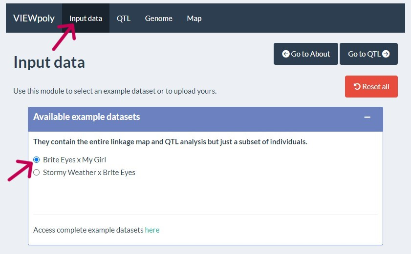
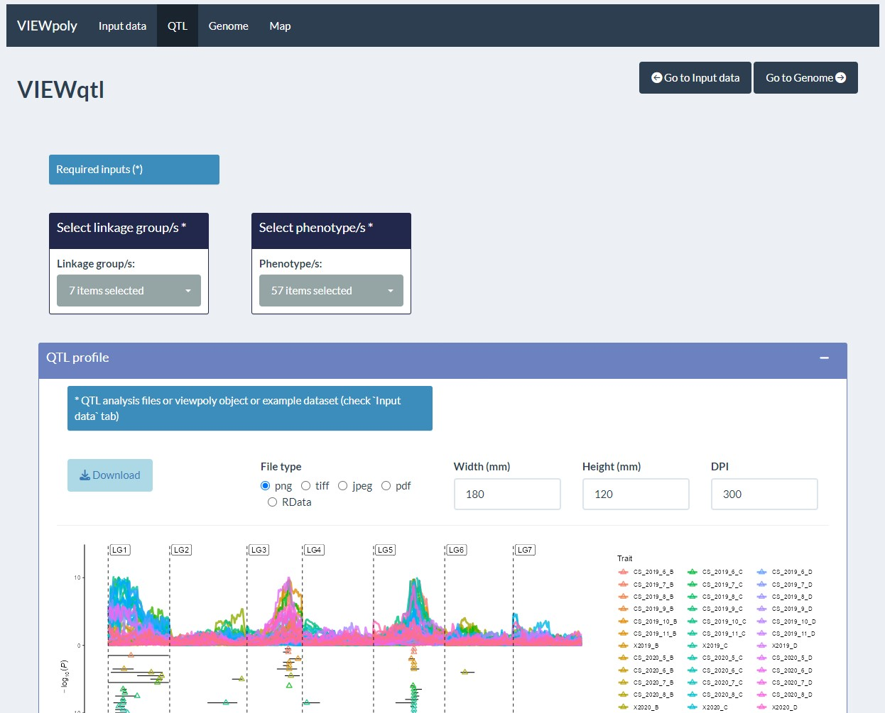
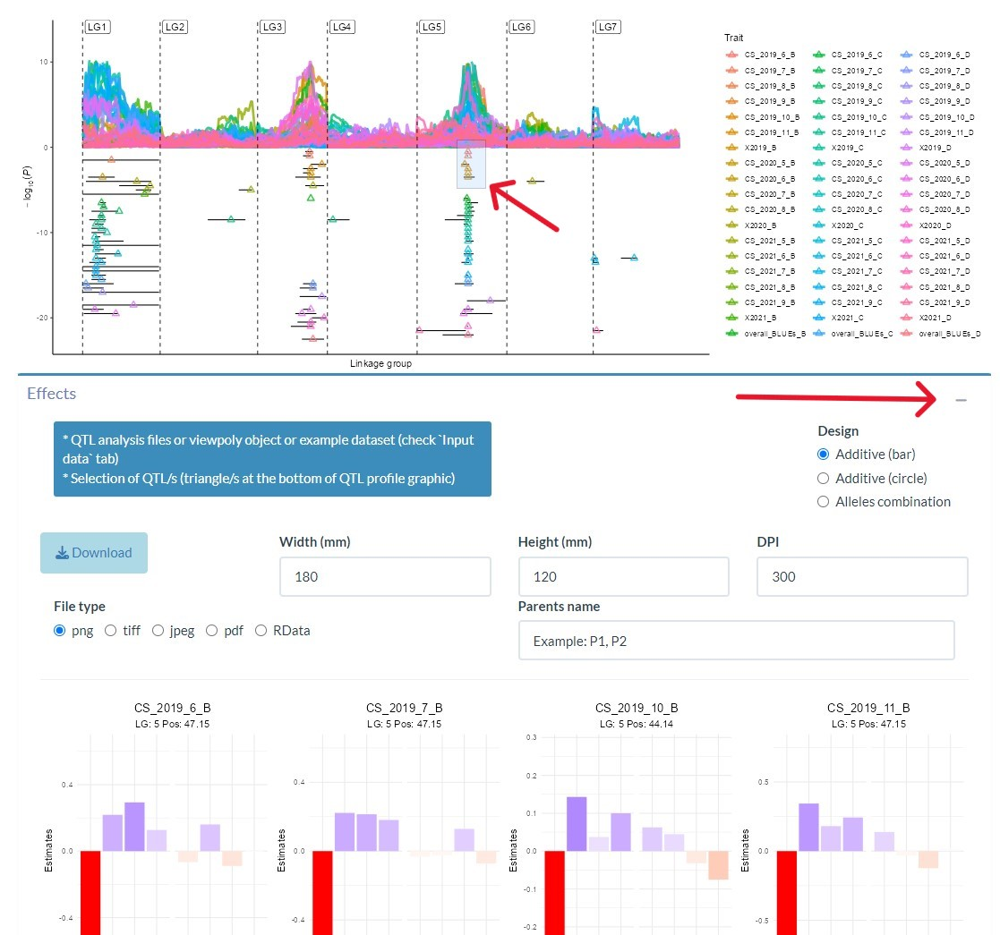
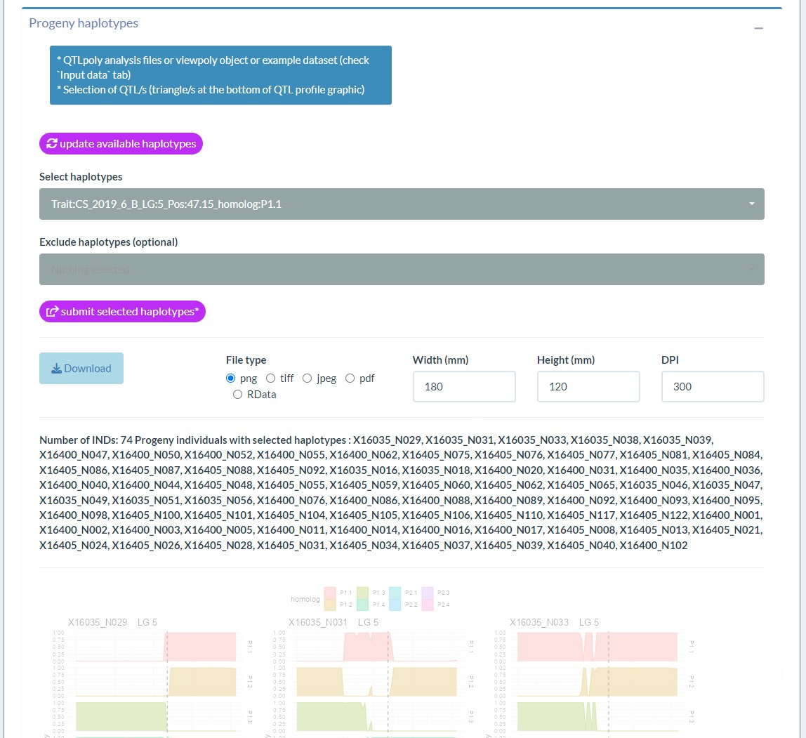

# How to view the Supplementary data
This is an R shiny app:

To view the supplementary data in this implementation of VIEWpoly please do the following:  
1. If you have devtools already installed you can skip the first line.
2. Use devtools install_github() to install this specific verion of VIEWpoly.
3. To run the customized version of VIEWpoly please run third line of code.  

```
install.packages("devtools")
devtools::install_github("jeekinlau/viewpoly_tetraploid_rose_disease_paper_supplementary_data")
viewpoly::run_app()
```

## Pick which mapping population to look at
From the Input data tab, you can choose which mapping population you want to look at.    
   

## Pick which chromosomes and which traits to look at
From the QTL tab you can select the linkage groups you want to explore and the phenotypes that you want to explore.      


## Explore parental haplotype effects
If you want to inspect a few QTL or just one QTL highlight the QTL on the QTL profile by selecting a box around the triangles (the QTL peaks) and open up the effects dropdown to view the parental homolog effects.    


## Select individuals with haplotypes of interest
After looking at the parental homolog effects, you can use the "Progeny Haplotypes" section to select or exclude any parental homologs at QTL positions and you get in return a list of progeny with or without parental alleles of interest.


# Other way to access the supplementary data:
This is another way to explore the supplementary data on shinyapps.io however, there is limited to 10 hours of server time per month thus if many people use this method the shiny app will not run http://jeekinlau.shinyapps.io/viewpoly_for_disease_paper


____________________________________________________


# VIEWpoly 

`VIEWpoly` is a shiny app and R package for visualizing and exploring results from [polyploid computational tools](https://www.polyploids.org/) using an interactive graphical user interface. The package allows users to directly upload output files from [polymapR](https://CRAN.R-project.org/package=polymapR), [MAPpoly](https://CRAN.R-project.org/package=mappoly) , [polyqtlR](https://CRAN.R-project.org/package=polyqtlR), [QTLpoly](https://CRAN.R-project.org/package=qtlpoly), 
[diaQTL](https://github.com/jendelman/diaQTL) and genomic assembly, variants, annotation and alignment files. VIEWpoly uses [shiny](https://CRAN.R-project.org/package=shiny), [golem](https://CRAN.R-project.org/package=golem), [ggplot2](https://CRAN.R-project.org/package=ggplot2), [plotly](https://CRAN.R-project.org/package=plotly), and [JBrowseR]( https://CRAN.R-project.org/package=JBrowseR) libraries to graphically display the QTL profiles, positions, alleles estimated effects, progeny individuals containing specific haplotypes and their breeding values. It is also possible to access marker dosage and parental phase from the linkage map.    
    
This is a modified version of VIEWpoly specifically used to display suppplementary results for a paper. Please visit [here](https://github.com/mmollina/viewpoly) for the proper VIEWpoly branch to see all of it's updates and current developments.

______________________________


